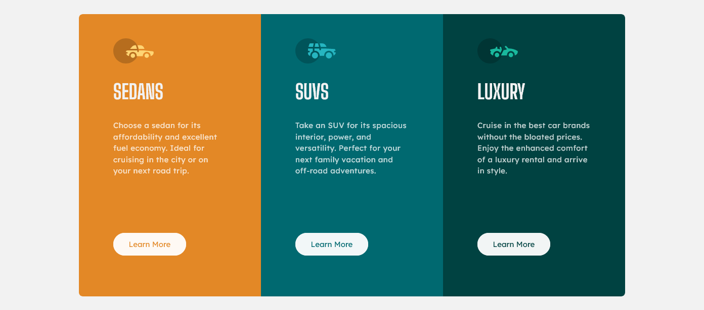

# Frontend Mentor - 3-column preview card component solution

This is a solution to the [3-column preview card component challenge on Frontend Mentor](https://www.frontendmentor.io/challenges/3column-preview-card-component-pH92eAR2-). Frontend Mentor challenges help you improve your coding skills by building realistic projects. 

## Overview

### The challenge

Users should be able to:

- View the optimal layout depending on their device's screen size
- See hover states for interactive elements

### Screenshot

### Links

- Solution URL: [Solution](https://www.frontendmentor.io/solutions/three-column-preview-card-challenge-2h2g_7zekz)
- Live Site URL: [Live Site](https://zwiro.github.io/3-column-preview-card-challenge/)

## My process

### Built with

- CSS custom properties
- Flexbox
- Mobile-first workflow
